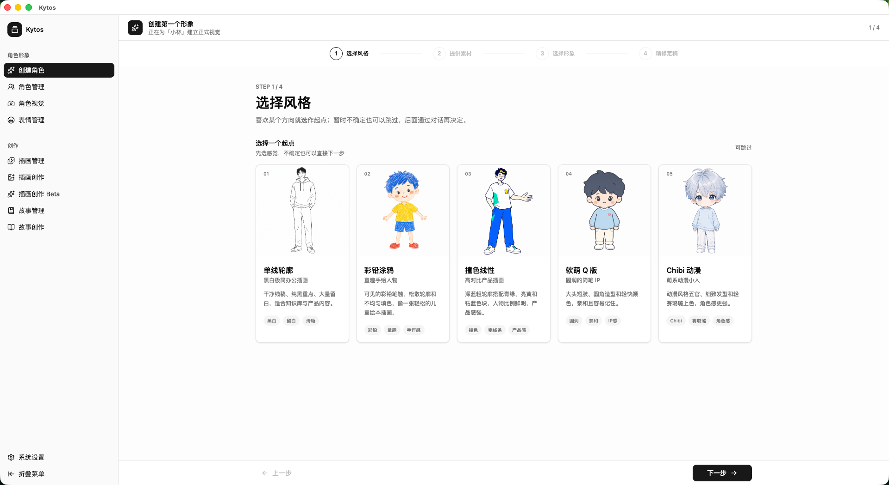
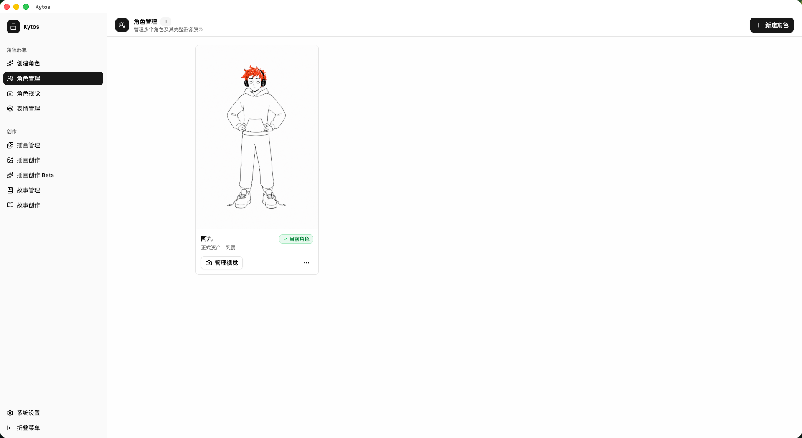
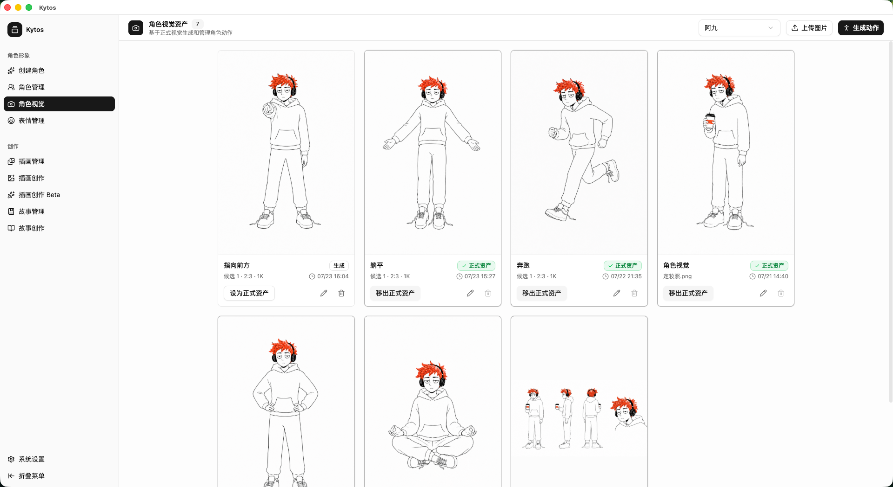
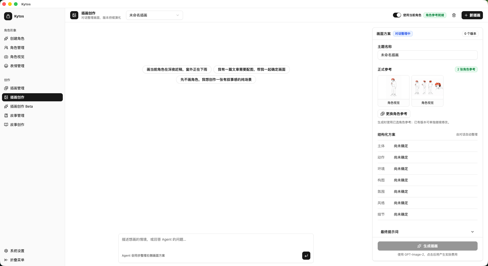
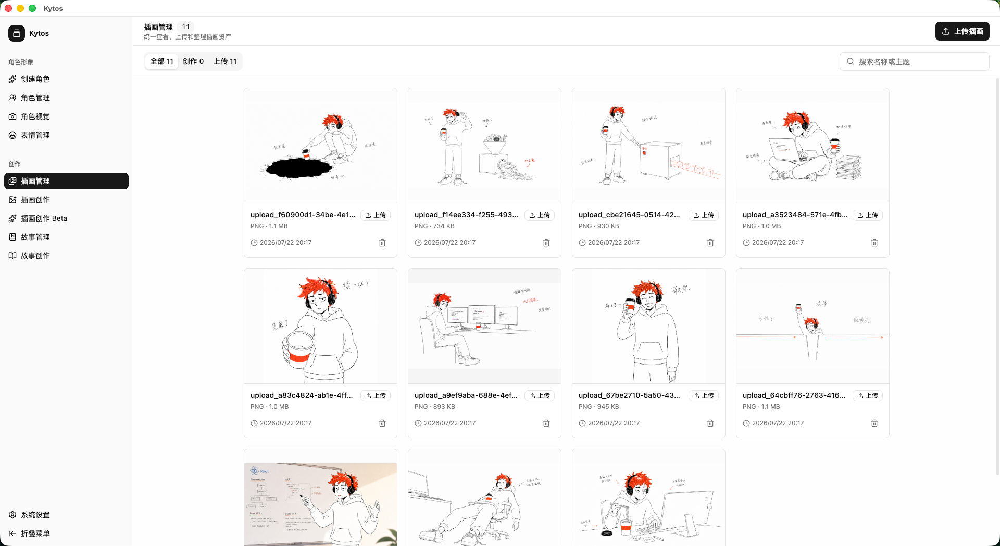
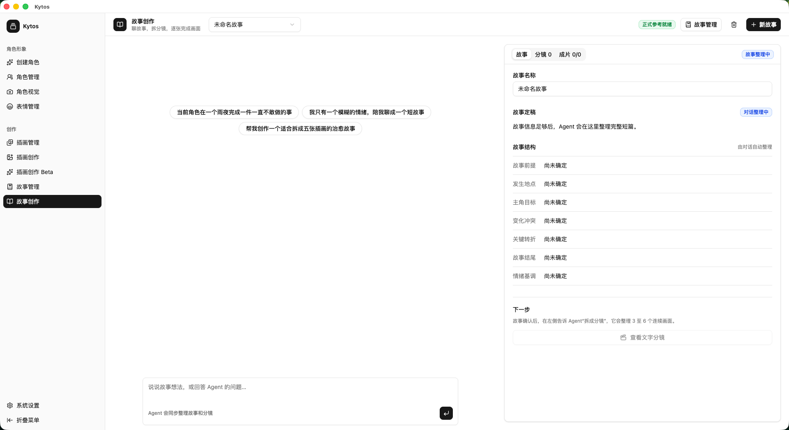
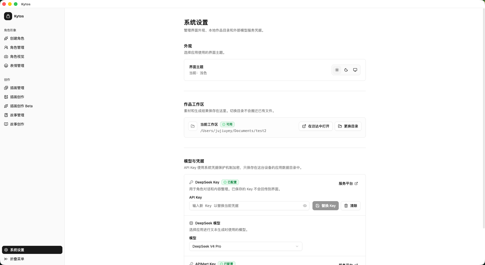

# Kytos

Kytos 是一个本地优先的 AI 角色与视觉内容创作工作台。

它把角色资料、角色锚点、动作与表情资产、插画和故事分镜放进同一个桌面工作区。你可以使用已有角色图片建立角色，再让这些经过确认的素材持续参与后续创作。作品数据留在你选择的本地目录，模型凭据由操作系统安全存储保护。

[完整文档](https://jujiuyey.github.io/Kytos/) · [快速开始](https://jujiuyey.github.io/Kytos/getting-started/) · [开发架构](https://jujiuyey.github.io/Kytos/developer/architecture)

> 项目状态：持续开发中。界面、数据结构和 AI 工作流可能继续调整。

## 产品工作流

Kytos 的核心不是一次性生成一张图片，而是让素材在一个工作区里继续被引用：

1. 创建角色，填写名称并上传一张已有角色锚点。
2. 在角色锚点中补充上传图片、动作图和参考板，明确哪些素材属于正式资产。
3. 基于角色锚点生成或上传表情，整理可复用的角色参考。
4. 在插画创作中组合角色、表情和已有图片，和 AI 共创主题并管理多个版本。
5. 在故事创作中整理故事草稿、确认分镜，再逐镜头生成和选择画面版本。

## 功能

### 角色资产

- 创建角色：填写角色名称并上传已有角色锚点。
- 角色管理：创建、选择、重命名和删除角色。
- 角色锚点：上传图片、生成动作、生成参考板，并管理正式资产。
- 表情管理：基于角色参考生成或上传表情，重命名和整理表情素材。
- 图片编辑：对工作区图片进行裁剪和编辑，并通过明确操作保存结果。







### 内容创作

- 插画创作：通过 AI 共创对话整理主题，选择参考图，生成并管理插画版本。
- 插画创作 Beta：体验基于节点画布的实验性插画流程。
- 插画管理：集中查看、上传、删除和整理插画资产。
- 故事管理：创建、打开、搜索和删除故事项目。
- 故事创作：整理故事、编排分镜，生成并选择镜头画面版本。







## 安装

需要 Node.js 22.12 或更高版本、pnpm 10、Git 和可运行 Electron 的桌面环境。

```bash
git clone https://github.com/JujiuYey/Kytos.git
cd Kytos
pnpm install
```

## 快速开始

启动 Electron 开发环境：

```bash
pnpm dev
```

首次启动时选择作品工作区。应用会检查目录是否可写，并在其中创建 `assets/` 和工作区数据库。

进入“系统设置”后，先选择默认模型，再配置对应的模型厂商凭据。完成后可以从“创建角色”开始。

## 配置外部服务

Kytos 不读取项目根目录中的 `.env` 来保存用户凭据。请在应用的“系统设置 → 模型厂商”中完成配置。

| 配置     | 用途                                                     |
| -------- | -------------------------------------------------------- |
| APIMart  | GPT-Image-2 图片生成：角色锚点动作、表情、插画和故事分镜 |
| DeepSeek | 插画和故事共创，以及动作、表情等提示词整理               |
| MiniMax  | 文本与多模态共创任务                                     |

应用只在主进程调用外部服务时读取 API Key。已保存的 API Key 不会回传到渲染界面，也不会写入作品工作区。



## 数据存储

作品工作区由用户选择，通常包含以下内容：

```text
Kytos/
├── kytos.sqlite3
└── assets/
    ├── character-candidates/
    ├── character-expressions/
    ├── character-portraits/
    ├── character-sheets/
    ├── illustrations/
    └── story-frames/
```

数据库保存角色、资产、生成任务、插画主题、故事和分镜等结构化数据；`assets/` 保存实际图片文件。部分目录名保留历史命名，请通过应用管理文件，不要手动重命名。

应用设置和加密凭据保存在 Electron 用户数据目录中，与作品工作区分开。切换工作区不会自动移动或删除旧目录中的文件。

## 开发

```bash
# Vue / TypeScript 构建
pnpm build:web

# 类型检查与静态检查
pnpm typecheck
pnpm lint

# 文档站
pnpm docs:dev
pnpm docs:build
```

常规前端改动只需要运行 `pnpm build:web` 及与改动文件匹配的 lint、格式检查和 `git diff --check`。完整 Electron 打包按需使用 `pnpm make`。

## 项目结构

```text
electron/                    Electron 主进程、IPC、领域服务和 Agent
shared/                      主进程、preload 与渲染端共享的类型和协议
src/views/                   按功能划分的页面入口
src/components/ui/           通用 UI 原语
src/components/ai-elements/  AI 对话与输入组件
src/components/sag/          Kytos 业务组合组件
src/stores/                  Pinia 状态管理
src/router/                  Vue Router 路由
src/assets/                  内置图片和风格素材
website/                     VitePress 文档站源码
.github/workflows/           GitHub Pages 自动发布流程
```

## 贡献

1. 创建一个功能分支。
2. 阅读并遵循 `AGENTS.md` 中的仓库约定。
3. 保持改动聚焦，完成后运行 `pnpm build:web`。
4. 对改动文件执行 lint、格式检查和 `git diff --check`。
5. 提交清晰的变更说明。

## 许可

Kytos 使用 MIT License，详见 [LICENSE](LICENSE)。
